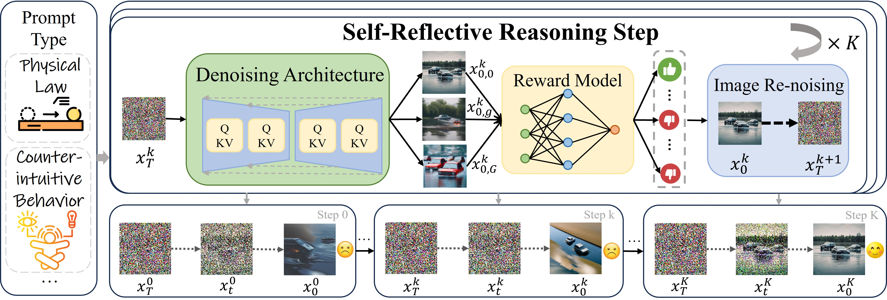

# Self-Reflective Reinforcement Learning for Diffusion-based Image Reasoning Generation

<div align="center">

[](https://arxiv.org/abs/2505.22407)&nbsp;
[](https://github.com/jadenpan0/SRRL)&nbsp;

</div>

<p align="center">

<p>

## Introduction

Diffusion models have recently demonstrated exceptional performance in image generation task. However, existing image generation methods still significantly suffer from the dilemma of image reasoning, especially in logic-centered image generation tasks. Inspired by the success of Chain of Thought (CoT) and Reinforcement Learning (RL) in LLMs, we propose SRRL, a self-reflective RL algorithm for diffusion models to achieve reasoning generation of logical images by performing reflection and iteration across generation trajectories. The intermediate samples in the denoising process carry noise, making accurate reward evaluation difficult. To address this challenge, SRRL treats the entire denoising trajectory as a CoT step with multi-round reflective denoising process and introduces condition guided forward process, which allows for reflective iteration between CoT steps. Through SRRL-based iterative diffusion training, we introduce image reasoning through CoT into generation tasks adhering to physical laws and unconventional physical phenomena for the first time. Notably, experimental results of case study exhibit that the superior performance of our SRRL algorithm even compared with GPT-4o.

## Run

Create a conda environment:

``` bash
conda env create -f environment.yml
```

Train SD v1.4 with SRRL:

```bash
bash train.sh 
```

Train SD XL with SRRL:

```bash
bash train_xl.sh
```

Hyperparameters are shown in `config/stage_process.py`.
Reward models are in `rewards/rewards.py`.


## Citation
If our work assists your research, feel free to cite us using:

```
@misc{pan2025selfreflectivereinforcementlearningdiffusionbased,
      title={Self-Reflective Reinforcement Learning for Diffusion-based Image Reasoning Generation}, 
      author={Jiadong Pan and Zhiyuan Ma and Kaiyan Zhang and Ning Ding and Bowen Zhou},
      year={2025},
      eprint={2505.22407},
      archivePrefix={arXiv},
      primaryClass={cs.CV},
      url={https://arxiv.org/abs/2505.22407}, 
}
```